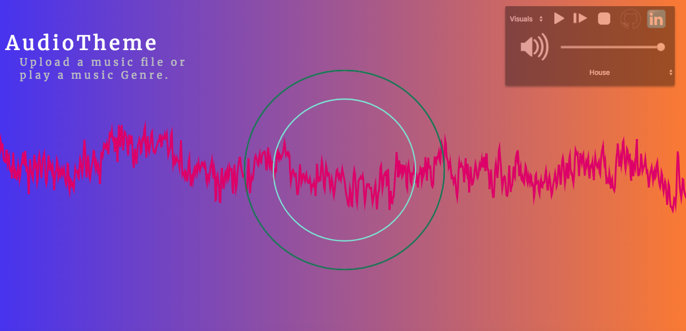

# Overview

AudioTheme allows you to play different types of music for whatever ocassion with visually appealing animations. It gives the user flexibility to either import their own individual music or to choose from a pre-existing music category. 

# Functionality
   * Users can upload mp3 files and play them from the main page
   * Users can choose from different categories to play their favorite type of music genre
   * Interactive background with music visuals based on frequency
   * Audio visuals are demonstrated through certain pitches and sounds that the music chosen produces

# Wireframes
The app will consist of a play/mute button, a dropdown for the choice of two different audio themes, a file submit button that allows the user to import a music file and a dropdown for the different types of music the user can choose. The music will be rendered through in-built music options and genres. 


### Technologies Employed
 * Vanilla Javascript (for audio)

 ```javascript
   function start() {
    bufferLoader = new BufferLoader(
      context,
      [
        hiphop[randomHipHop],
        house[randomHouse],
        randb[randomRandb],
        onehitwonders[oneHitWonders],
        classical[classicalMusic],
        alternative[alternativeMusic]
      ],
      finishedLoading
    );

    bufferLoader.load();
    
    // audio analyzers
    analyser.fftSize = 2048;
    analyser2.fftSize = 32;
    analyser3.fftSize = 512;
    analyser4.fftSize = 256;

    var bufferLength = analyser.frequencyBinCount;
    var dataArray = new Uint8Array(bufferLength);
 ```
 * CSS/HTML (for visuals)



 * JS Canvas (for visuals)
    ```javascript
    const canvas = document.getElementById("analyser-render");
    canvas.width = window.innerWidth - 2;
    canvas.height = window.innerHeight - 2;
    const canvasCtx = canvas.getContext("2d");

    canvasCtx.fillStyle = 'rgb(200, 200, 200)';
    canvasCtx.fillRect(0, 0, canvas.width, canvas.height);

    function draw() {
      canvasCtx.clearRect(0, 0, canvas.width, canvas.height);
      requestAnimationFrame(draw);

      analyser.getByteTimeDomainData(dataArray);
      analyser.getByteFrequencyData(dataArray2);

      canvasCtx.lineWidth = 3.15;
      function r() {
        return Math.floor(Math.random() * 255);
      }

      canvasCtx.strokeStyle = "rgb(" + r() + "," + 0 + "," + r() + ")";
      canvasCtx.beginPath();
      var sliceWidth = canvas.width * 1.0 / bufferLength;
      var x = 0;
     ``` 

### Main files
 * Pick an interactive background that can be used for all different types of music
 * Be especially detailed

# MVPs
 * [X] Basic interactive visuals with an interactive homepage
 * [ ] Options for two different visualization styles based on music
 * [ ] User can input mp3 files through the main page
 * [X] User can choose different music types based on different criteria

## Developemnt timeline

Day 1:
 * [X] Finish branstorming ideas, create proposal.
 * [X] Complete basic page skeleton and start doing research
 
Day 2:
 * [X] Research and implementation of backgrounds for files
 * [X] Functionality of playing music on the page
 * [ ] Functionality of allowing user to input a file to play music

Day 3:
 * [X] Implement the visualizations for the background
 * [X] Visualization functionality and dropdown
 * [X] Link to SoundCloud / import music for testing

 
Day 4:
 * [X] Complete testing 
 * [X] Make sure all functinoality is good
 * [X] Add CSS styling to missing places
 
Weekend:
 * [ ] Implement bonus features.
 * [X] Deploy and check for any bugs.
 
 
# Future Features may include
 * Completion of Project
 * Connect the SoundCloud API to music to generate all kinds of music
 * Multiple pages for different types of music
 * Additional page for music uploading files and music rendering/bars visualization
